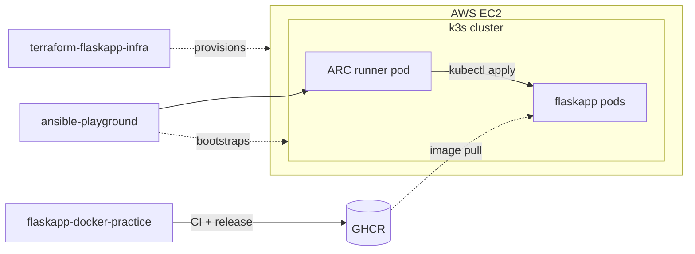

# ansible-playground

[](https://github.com/prsmalley/ansible-playground/actions/workflows/lint.yml)
[](LICENSE)

**Status:** Deployed and serving (last deploy 2026-05-20). The cluster lives on the EC2 provisioned by [terraform-flaskapp-infra](https://github.com/prsmalley/terraform-flaskapp-infra). flaskapp pods are currently reachable only from the operator IP (security group restriction); opening the app via DNS + HTTPS is the next planned step.

This repo owns cluster bootstrap and per-release deploys: it installs k3s on a fresh EC2 host and ships Kubernetes manifests to the cluster via an ephemeral self-hosted GitHub Actions runner (ARC). It's one of three repos that together build, provision, and deploy a Flask app to a k3s cluster on AWS EC2:

- **[flaskapp-docker-practice](https://github.com/prsmalley/flaskapp-docker-practice)** — builds and publishes the container image to GHCR.
- **[terraform-flaskapp-infra](https://github.com/prsmalley/terraform-flaskapp-infra)** — provisions the EC2 host.
- **ansible-playground** — bootstraps k3s and deploys the app via ephemeral self-hosted runners (ARC) running inside the cluster.

See [ARCHITECTURE.md](ARCHITECTURE.md) for the full design.



## Repo layout

```
.
├── ansible.cfg                 # Ansible defaults
├── inventory.ini.example       # Copy to inventory.ini for bootstrap
├── requirements.yml            # Ansible collections (community.docker — used by legacy/ only)
├── bootstrap-k3s.yml           # k3s install playbook (one-time per cluster)
├── manifests/                  # K8s manifests applied per deploy
│   ├── deployment.yaml
│   ├── service.yaml
│   └── ingress.yaml
├── setup/                      # One-time cluster bootstrap (not redeployed)
│   └── rbac.yaml               # ServiceAccount + Role + RoleBinding for deploy-runner
├── legacy/                     # Archived from earlier architecture iterations
├── .github/workflows/
│   ├── lint.yml                # ansible-lint on every PR
│   └── deploy.yml              # ARC ephemeral runner runs kubectl apply
├── BOOTSTRAP.md                # One-time cluster setup runbook
└── ARCHITECTURE.md             # End-to-end design across all three repos
```

## Deploying (per-release)

After the one-time cluster setup, deploys are triggered from the CLI or the GitHub Actions UI:

```bash
gh workflow run deploy.yml \
  -f image_tag=sha-abc1234 \
  -f dry_run=false
```

Set `dry_run=true` to preview what would be applied without making changes — useful for verifying a new image tag before a real deploy.

What happens when you trigger it:

1. `release.yml` in flaskapp-docker-practice has already published a multi-arch OCI image to GHCR.
2. Operator triggers `deploy.yml` via `workflow_dispatch` (the command above).
3. ARC's listener detects the queued job and spawns an ephemeral self-hosted runner pod inside the k3s cluster.
4. The runner pod authenticates to the K8s API via its mounted ServiceAccount token, `sed`-substitutes the image tag into `manifests/deployment.yaml`, and runs `kubectl apply -f manifests/`.
5. k3s reconciles to the declared state; flaskapp pods come up and reach Ready when their readiness probes pass.
6. `kubectl rollout status` blocks until the new pods are Ready; the runner pod terminates.

## Initial cluster setup

One-time procedure for spinning up a new cluster from scratch. See [BOOTSTRAP.md](BOOTSTRAP.md) for the full operator runbook (~30 minutes end to end, assuming AWS / GitHub / SSH credentials are already in place). After bootstrap, deploys are workflow-triggered as above.

## Linting

`ansible-lint` runs on every PR via [lint.yml](.github/workflows/lint.yml) at the production profile. To run locally:

```bash
pip install ansible-lint
ansible-galaxy collection install -r requirements.yml
ansible-lint
```

## Legacy (`legacy/`)

Archived files from earlier architecture iterations. Kept for portfolio depth and as Ansible examples; not part of the active deploy.

- `site.yml` — early Ansible learning playbook. Multipass VM config (packages, user, templated config, nginx). Demonstrates templates, handlers, multi-module orchestration.
- `deploy-flaskapp.yml` — Ansible-based deploy that pulled the image and ran it via Docker on a single host. Replaced by the K8s deploy. Demonstrates the `community.docker` collection.
- `inventory-runner.ini` — inventory used by the old `deploy.yml` workflow when the runner was the deploy target (Multipass VM era).

## License

MIT — see [LICENSE](LICENSE).
